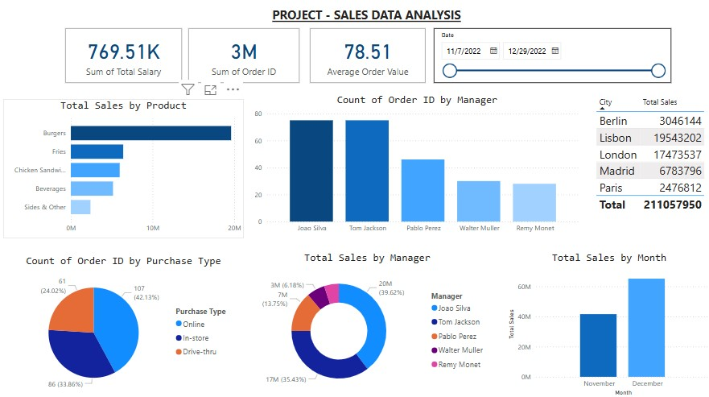

# SALES DATA ANALYSIS

## Dataset

**File Name:** SalesDataAnalysis.xlsx  
**Description:** Contains sales data including order IDs, product categories, cities, purchase types, and sales managers.

## Objective

To perform a comprehensive sales data analysis to:
- Understand revenue trends
- Identify high-performing products, cities, and managers
- Analyze order counts and sales by purchase type
- Visualize sales performance over time

## Tools Used

- Microsoft Power BI – for data visualization and dashboard creation
- Excel – for data cleaning and exploration

## Dashboard Insights

### Key Metrics

- Total Salary (Sum): 769.51K  
- Total Orders (Sum of Order ID): 3M  
- Average Order Value: 78.51  
- Time Period: 11/7/2022 to 12/29/2022

### Visualizations

1. **Total Sales by Product**
   - Highest: Burgers (~20M)
   - Others: Fries, Chicken Sandwiches, Beverages, Sides & Others

2. **Count of Order ID by Manager**
   - Joao Silva and Tom Jackson lead in number of orders

3. **City-wise Total Sales**
   - Berlin: 3.04M
   - Lisbon: 19.54M
   - London: 17.43M
   - Madrid: 6.78M
   - Paris: 2.47M  
   - Total Sales: 21.1M

4. **Count of Orders by Purchase Type**
   - Online: 42.13 percent
   - In-store: 33.86 percent
   - Drive-thru: 24.02 percent

5. **Total Sales by Manager**
   - Joao Silva: 20M (39.62 percent)
   - Tom Jackson: 17M
   - Pablo Perez: 7M
   - Others: Walter Muller, Remy Monet

6. **Total Sales by Month**
   - November vs December comparison
   - December has higher total sales (~60M)

## Data Cleaning Steps

- Removed null or blank rows
- Standardized city and product names
- Checked for duplicate Order IDs
- Formatted dates to DD/MM/YYYY format

## How to Use

1. Clone the repository:

2. Open SalesDataAnalysis.xlsx in Excel to explore raw data

3. Open SalesDashboard.pbix in Power BI (if available) to explore the dashboard

4. Or view the final dashboard screenshot provided above

## Outcome

The dashboard provides insights that help stakeholders:
- Monitor sales performance by product and city
- Track manager-wise sales contribution
- Understand customer behavior by purchase type
- Make data-driven business decisions

